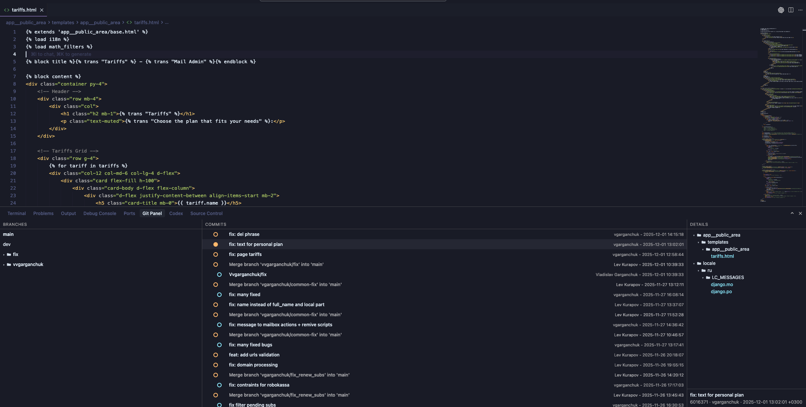

  
  <h1>Git Panel</h1>
  
Compact Git UI panel for VS Code and Cursor

Git Panel is a minimal, fast Git UI that lives in the bottom panel of VS Code / Cursor.  
It shows branches, commits and commit details in a clean 3-column layout and focuses on everyday workflows.

---

## 📸 Screenshot

  

---

## ▶️ Usage

1. Open a Git repository folder in VS Code / Cursor.
2. Open the **Git Panel** view in the bottom panel.
3. In the left column:
   - Choose a branch; commits for that branch appear in the middle column.
4. In the commits column:
   - Click a commit to see file changes and metadata in the right column.
   - Use right click on commits for actions like squash, reset, cherry-pick.
5. In the details column:
   - Click files to open diffs.
   - Right-click a file → **Edit Source** to open it directly.

---

## 📝 License

This project is licensed under the MIT License – see the [`LICENSE`](LICENSE) file for details.

